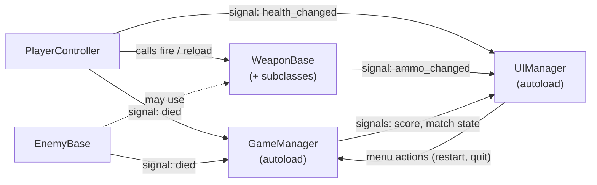

# Architecture

This is a short overview of how the game is put together. Each system in the list at the bottom
is written so it can become a GitHub issue people can claim.

## How the pieces fit

**Call down, signal up:**

- A parent may call methods on its children. The player calls `fire()` on its weapon.
- Children never reach up. They **emit signals** (`died`, `health_changed`, `ammo_changed`) and
  whoever cares connects to them.
- **UIManager only listens.** It displays state and never changes gameplay, except when menu
  buttons call into GameManager.
- **GameManager owns the match**: which map is loaded, spawning, score, win/lose.

**Scene flow:** `scenes/main.tscn` is the run scene. For now it instances
`scenes/maps/placeholder_map.tscn`. Once the map loader exists, GameManager decides which map
goes there and spawns the player into it.

**Shared setup already in place** (`project.godot`):

- Autoloads: `GameManager`, `UIManager`
- 3D physics layers: `1 world`, `2 player`, `3 enemies`, `4 projectiles`, `5 pickups`

## Systems to build

Each item below is meant to be one GitHub issue (large ones split into a few). **Depends on**
lists what needs to exist first. Pieces with no dependencies can start right away.

### Foundation (do these first, since others build on them)

1. **Input map**: define actions (`move_forward`, `move_back`, `move_left`, `move_right`,
   `jump`, `crouch`, `sprint`, `fire`, `aim`, `reload`, `weapon_next`, `weapon_prev`, `pause`)
   in Project Settings. *Touches `project.godot`. Keep this PR tiny.*
2. **Damage/health contract**: agree on one way to deal damage that player, enemies, and
   breakables all share (e.g. a `take_damage(amount, source)` method or a `Health` component
   node in `scripts/core/`). *Document it here once decided.*
3. **Greybox test map**: a simple blockout map in `scenes/maps/` with floor, walls, cover,
   spawn points, and a navigation mesh. Replaces the placeholder.

### Player (`scenes/player/`, `scripts/player/`)

4. **Player movement**: walk, sprint, jump, crouch, gravity. *Depends on: 1*
5. **Mouse look & camera**: FPS camera, sensitivity, mouse capture. *Depends on: 1*
6. **Player health & death**: take damage, emit `died`/`health_changed`. *Depends on: 2*
7. **Weapon holding & switching**: weapon slot on the camera, cycle weapons. *Depends on: 5, 8*

### Weapons (`scenes/weapons/`, `scripts/weapons/`)

8. **WeaponBase core**: fire rate, ammo, reload, `ammo_changed` signal. *Depends on: 1*
9. **Hitscan weapon** (e.g. rifle) extending WeaponBase. *Depends on: 2, 8*
10. **Projectile weapon** (e.g. grenade/rocket) extending WeaponBase. *Depends on: 2, 8*
11. **Weapon feedback**: muzzle flash, recoil, fire/reload sounds, impact decals. *Depends on: 9*

### Enemies (`scenes/enemies/`, `scripts/enemies/`)

12. **EnemyBase core**: health, death, `died` signal. *Depends on: 2*
13. **Enemy navigation & AI states**: idle → chase → attack using NavigationAgent3D. *Depends on: 3, 12*
14. **First enemy type**: a concrete enemy scene and script extending EnemyBase. *Depends on: 13*

### Game flow (`scripts/core/`)

15. **Match flow**: start, win/lose, restart, and the matching GameManager signals. *Depends on: 6, 12*
16. **Spawning & respawning**: player spawn points, enemy spawner or waves. *Depends on: 3, 15*
17. **Map loading**: GameManager swaps maps into `main.tscn`. *Depends on: 3*

### UI (`scenes/ui/`, `scripts/ui/`)

18. **HUD**: health, ammo, crosshair, score. *Depends on: 6, 8*
19. **Main menu**: play, settings, quit. *No dependencies*
20. **Pause menu**: resume, settings, quit to menu. *Depends on: 1*
21. **Settings**: mouse sensitivity, volume, graphics. *Depends on: 19*
22. **Game over / victory screen**. *Depends on: 15*

### Art & audio (`assets/`, always via Git LFS)

23. **Weapon models** (one issue per weapon)
24. **Enemy model & animations**
25. **Environment kit**: modular walls, floors, props for maps
26. **Sound effects**: weapons, footsteps, hits, UI clicks
27. **Music**: menu and in-game tracks
28. **UI art & fonts**: crosshair, icons, HUD font

### Tooling (optional)

29. ~~**CI check**~~ ✅ Done: `.github/workflows/godot-check.yml` opens the project headless on every push and PR.
30. **Issue & PR templates** in `.github/`.
